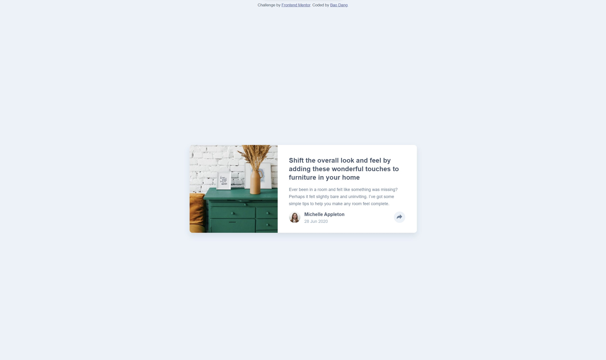

# Frontend Mentor - Article preview component solution

## Table of contents

- [Overview](#overview)
  - [The challenge](#the-challenge)
  - [Screenshot](#screenshot)
  - [Links](#links)
- [My process](#my-process)
  - [Built with](#built-with)
  - [What I learned](#what-i-learned)
  - [Continued development](#continued-development)
  - [Useful resources](#useful-resources)
- [Author](#author)
- [Acknowledgments](#acknowledgments)

## Overview

- This is my second front end project which displays a simple article post.

### Screenshot

### Links

- Solution URL: [Frontend Mentor](https://www.frontendmentor.io/solutions/messy-website-with-messy-js--L7ie_lsH)
- Live Site URL: [Article Preview](https://weebao.github.io/article-preview-component-master/)

## My process

- I have been wanting to learn SCSS so I looked up different features of SCSS before starting.
- I started with adding all the HTML components.
- I centered a rectangular div and adjust the box to look closer to the design.
- I finished with the SCSS, but I felt like I could have organized it better.
- I started working on the popping function, which was my first time applying JS to a website.
- The concept of the share button was simple enough so I finished with the JS and had it work nicely.

### Challenges

- First challenge was the share button. I created the circle by styling `<image>` directly but somehow the share icon was not centered. After a lot of panicking and adjusting with `translate`, I figured out an easy way out is to just put the image in a div and style the div.
- My second challenge was the JS part. It was my first time applying JS to a website so I had to look up and learn about DOM and eventListener. The idea of selecting element and editting the style in JS was quite straightforward but there were errors when I ran the website. So, I looked up and learned about how the content in DOM not being loaded before the JS and also about useful functions like async and defer, which helped nicely.

### Built with

- HTML
- SCSS

### Useful resources

- [Web Dev Simplified](https://www.youtube.com/c/WebDevSimplified) - Kyle helped me a lot in figuring out the JS part of this project.

## Author

- Website - [Bao Dang](https://github.com/weebao)
- Frontend Mentor - [@Bao Dang](https://www.frontendmentor.io/profile/weebao)
